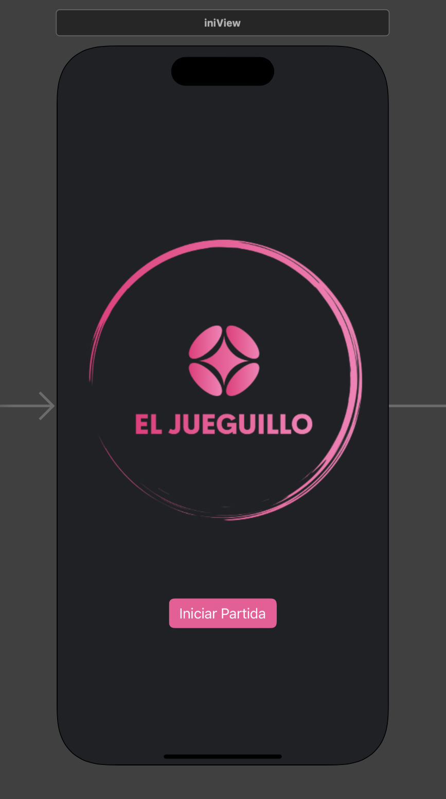

# tarea01
# Nombre de la aplicación 
El jueguillo
## Descripcion de la aplicación
Esta aplicacion consiste en un pequeño juego de memoria en el que el objetivo es recordar las imagenes en orden obteniendo asi una puntuación y permitir al jugador guardar esta con su nombre
## Pantallas
- Pantalla de inicio
- Pantalla de juego
- Pantalla de puntuaciones *Se guarda en PostMan*
___
## Captura de pantalla 

___
## Ejemplo de codigo del proyecto

func application(_ application: UIApplication, configurationForConnecting connectingSceneSession: UISceneSession, options: UIScene.ConnectionOptions) -> UISceneConfiguration {
    // Called when a new scene session is being created.
    // Use this method to select a configuration to create the new scene with.
    return UISceneConfiguration(name: "Default Configuration", sessionRole: connectingSceneSession.role)
}

